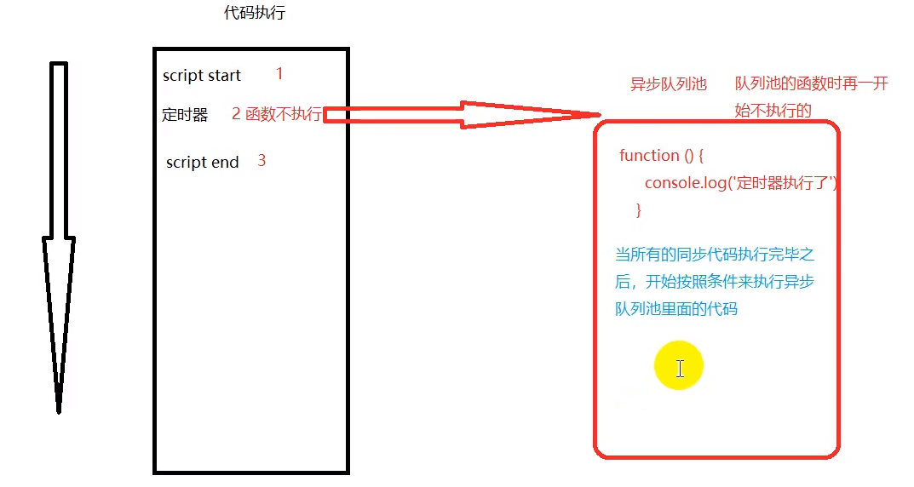
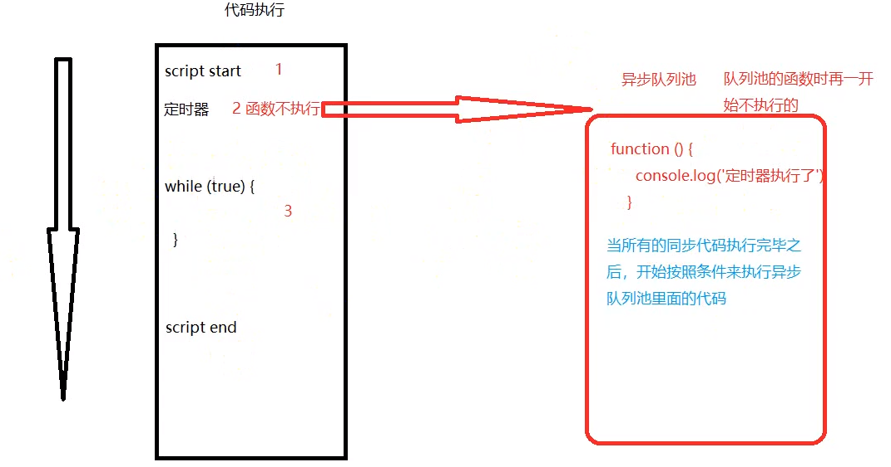

## 执行上下文 / 预编译
### 预编译之前
1. **暗示全局变量**：任何变量（即使在函数中），如果未经声明就赋值，此变量就为全局对象(window)所有
2. 一切声明的全局变量，全都是 windows 的属性
### 预编译（发生在函数执行的前一刻）
1. 创建AO对象（Activation Object / 执行上下文）/GO对象（GO === window）
2. 找形参和变量声明，将形参和变量声明作为AO对象/GO对象属性名，值为undefined
3. 将实参的值赋给形参
4. 给 this 赋值，默认是 window
5. 将函数体里的函数声明赋给函数体

### 练习1
```javascript
function test(a, b) {
    console.log(a); 
    c = 0; 
    var c; 
    a = 3;
    b = 2; 
    console.log(b); 
    function b() {} 
    function d() {}
    console.log(b); 
}    

test(1);
```
<details><summary><b>答案解析</b></summary>
1 <br>
2 <br>
2 <br>

### 解析:
第一步和第二步：创建AO对象，并给形参和变量赋值为undefined
```javascript
AO {
    a: undefined,
    b: undefined
}
```
第三步：将实参作为值赋给形参
```javascript
AO {
    a: 1,
    b: undefined
}
```
第四步：将函数体里的函数声明赋给函数体
```javascript
AO {
    a: 1,
    b: function b() {}
}
```
最后再逐行执行函数
</details>

### 练习2
```javascript
function test(a,b) {
    console.log(a); 
    console.log(b); 
    var b = 234; 
    console.log(b); 
    a = 123; 
    console.log(a); 
    function a () {}
    var a;
    b = 234; 
    var b = function () {}
    console.log(a); 
    console.log(b); 
}

test(1);
```
<details><summary><b>答案解析</b></summary>

function a () {} <br>
undefined <br>
234 <br>
123 <br>
123 <br>
function () {} <br>

</details>

### 练习3
```javascript
function a() {
    function b() {
        var bb = 234;
        aa = 0;
    }
    var aa = 123;
    b();
    console.log(aa);
}
var glob = 100;
a();
```
<details><summary><b>答案解析</b></summary>

0
</details>

### 练习4
```javascript
var x = 1, y = z = 0; 

function add(n) {
    return n = n + 1;
}

y = add(x); 

function add(n){
    return n = n + 3; 
}
z = add(x);

console.log(x);
console.log(y);
console.log(z);
```
<details><summary><b>答案解析</b></summary>

1 <br>
4 <br>
4 <br>

解析： <br>
函数提升后，GO里的add已经被最后一次函数声明覆盖了<br>
（即： f  add(n) { return n = n + 3; } ）
再执行代码时不会再看函数声明了，函数声明根本不会执行。简单来说 y 和 z 执行的都是第二次声明的函数。

</details>

---
## 原型和闭包
> 每个函数都有一个 prototype ，及原型 <br>
> 每个对象都有一个__proto__ （隐式原型），这是一个隐藏的属性

推荐文章：[深入理解javascript原型和闭包](https://www.cnblogs.com/wangfupeng1988/p/4001284.html)

### 练习1：
```javascript
var bar = { a:"002" }; 

function print() {
    bar.a = 'a'; 
    Object.prototype.b = 'b'; 
    return function inner() {
        console.log(bar.a); 
        console.log(bar.b); 
    }
}

print()();
```

<details><summary><b>答案</b></summary>

a <br>
b
</details>

---
## this
> 1. 函数预编译过程 this --> window
> 2. 全局作用域里 this --> window
> 3. call/apply 可以改变函数运行时 this 指向
> 4. 谁调用方法，this 就指向谁
> 5. 定时器里调用，this 指向 window

### 练习1：
```javascript
var name = "222";
var a = {
    name: "111",
    say: function () {
        console.log(this.name);
    }
}
var fun = a.say;
fun();
a.say();
var b = {
    name: "333",
    say: function (fun) {
        fun();
    }
}
b.say(a.say);
b.say = a.say;
b.say();
```

<details><summary><b>答案</b></summary>

```javascript
222 /* 相当于执行: 
    *  function fun() {
    *      console.log(this.name)
    *  }
    *  fun() 的 this 指向 window
    */

111 // 对象 a 调用的 say 方法，则 this 指向 a

222 /* 对象 b 里的 say方法中的 fun()并没有被谁调用
    *  所以 this 还是指向 window
    */

333 // this 指向 b
```
</details>

### 练习2：
```javascript
var foo = 123; 

function print(){
    var foo = 456;
    this.foo = 234; 
    console.log(foo);
    console.log(this);
}

print();
```
<details><summary><b>答案</b></summary>

456 <br>
window

</details>

### 练习3：
```javascript
var a = 5; 

function test(){
    a=0; 
    console.log(a); 
    console.log(this.a);
    var a;
    console.log(a);
}

new test();
```
<details><summary><b>答案</b></summary>

0 <br>
undefined <br>
0

解析：使用 new 后，产生一个新对象，this 里没有 a
</details>

### 练习4：
```javascript
var length = 10;
function fn() {
console.log(this.length);
}

var obj = {
length: 5,
method: function(fn) {
    fn();
    console.log(arguments.length);
}
};

obj.method(fn, 1);
```
<details><summary><b>答案</b></summary>

10 <br> 2
</details>
---

## js 运行机制 -- 异步



## 深拷贝、浅拷贝

## 实践

## 定时器

## 伪数组

## 正则表达式

## instanceof

## new 关键字
### 构造函数
### new
[new 命令](https://wangdoc.com/javascript/oop/new.html#new-%E5%91%BD%E4%BB%A4%E7%9A%84%E5%8E%9F%E7%90%86)

## 回调函数
[回调函数](https://blog.csdn.net/hu_belif/article/details/80284140) <br>
[同步回调，异步回调](https://blog.csdn.net/qq_31930499/article/details/80654472) <br>
[回调地狱](https://blog.csdn.net/qq_21602341/article/details/87820778)

## JS常见错误类型
[JS常见错误类型](https://www.jianshu.com/p/ef9f0b1f7382) <br>
[Error MDN](https://developer.mozilla.org/zh-CN/docs/Web/JavaScript/Reference/Global_Objects/Error)

## 严格模式