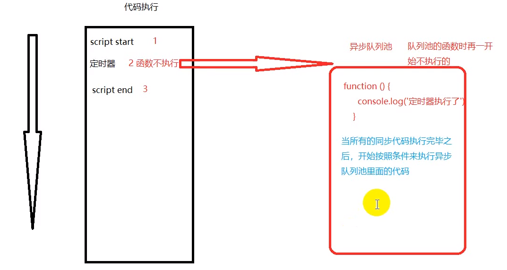

## 原型和闭包
> 每个函数都有一个 prototype ，及原型 <br>
> 每个对象都有一个__proto__ （隐式原型），这是一个隐藏的属性

推荐文章：[深入理解javascript原型和闭包](https://www.cnblogs.com/wangfupeng1988/p/4001284.html)

### 练习1：
```javascript
var bar = { a:"002" }; 

function print() {
    bar.a = 'a'; 
    Object.prototype.b = 'b'; 
    return function inner() {
        console.log(bar.a); 
        console.log(bar.b); 
    }
}

print()();
```

<details><summary><b>答案</b></summary>

a <br>
b
</details>

---
## this
> 1. 函数预编译过程 this --> window
> 2. 全局作用域里 this --> window
> 3. call/apply 可以改变函数运行时 this 指向
> 4. 谁调用方法，this 就指向谁
> 5. 定时器里调用，this 指向 window

### 练习1：
```javascript
var name = "222";
var a = {
    name: "111",
    say: function () {
        console.log(this.name);
    }
}
var fun = a.say;
fun();
a.say();
var b = {
    name: "333",
    say: function (fun) {
        fun();
    }
}
b.say(a.say);
b.say = a.say;
b.say();
```

<details><summary><b>答案</b></summary>

```javascript
222 /* 相当于执行: 
    *  function fun() {
    *      console.log(this.name)
    *  }
    *  fun() 的 this 指向 window
    */

111 // 对象 a 调用的 say 方法，则 this 指向 a

222 /* 对象 b 里的 say方法中的 fun()并没有被谁调用
    *  所以 this 还是指向 window
    */

333 // this 指向 b
```
</details>

### 练习2：
```javascript
var foo = 123; 

function print(){
    var foo = 456;
    this.foo = 234; 
    console.log(foo);
    console.log(this);
}

print();
```
<details><summary><b>答案</b></summary>

456 <br>
window

</details>

### 练习3：
```javascript
var a = 5; 

function test(){
    a=0; 
    console.log(a); 
    console.log(this.a);
    var a;
    console.log(a);
}

new test();
```
<details><summary><b>答案</b></summary>

0 <br>
undefined <br>
0

解析：使用 new 后，产生一个新对象，this 里没有 a
</details>

---

## js 运行机制 -- 异步



## 深拷贝、浅拷贝

## 实践

## 定时器

## 伪数组

## 正则表达式